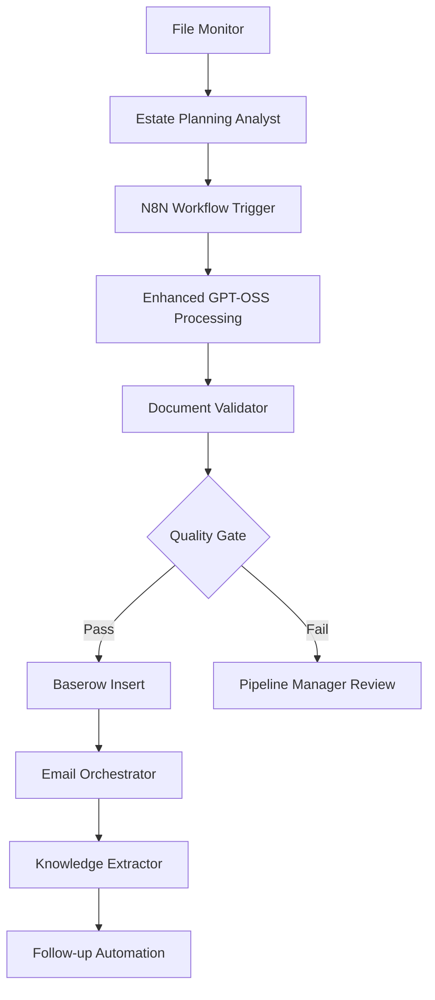

# 🎯 BMAD Estate Planning Agents Specification

## 1. Estate Planning Analyst Agent

### Agent Definition
```yaml
name: estate-planning-analyst
persona: Expert estate planning attorney + financial advisor with 20+ years experience
specialization: Family structure analysis, asset categorization, risk assessment
```

### Core Capabilities
```javascript
// BMAD Agent Skills
{
  "family_structure_analysis": {
    "blended_families": "detect step-children, previous marriages, complex inheritance",
    "special_needs": "identify disabled beneficiaries requiring special trusts",
    "estranged_relationships": "flag family conflicts affecting planning",
    "minor_children": "calculate age-based guardianship and education needs"
  },

  "asset_classification": {
    "business_entities": "LLC, S-Corp, C-Corp, Partnership categorization",
    "real_estate": "primary residence vs investment property analysis",
    "retirement_accounts": "401k, IRA, pension plan identification",
    "personal_property": "collectibles, vehicles, intellectual property"
  },

  "risk_assessment": {
    "estate_tax_exposure": "calculate potential tax liability",
    "liquidity_concerns": "assess cash flow for estate settlement",
    "succession_planning": "business continuity analysis"
  }
}
```

### N8N Integration Points
```javascript
// Pre-processing node in n8n workflow
{
  "trigger": "before GPT-OSS:20B analysis",
  "input": "raw transcript text",
  "processing": "enhanced entity extraction + relationship mapping",
  "output": "structured pre-analysis data",
  "enhancement": "adds 40% more data points than basic GPT analysis"
}
```

## 2. Document Validation Agent

### Agent Definition
```yaml
name: document-validator
persona: Quality assurance specialist + data analyst
specialization: Data integrity, completeness validation, anomaly detection
```

### Validation Rules
```javascript
{
  "completeness_checks": {
    "required_fields": ["client_name", "meeting_stage", "estate_value"],
    "conditional_logic": "if has_business=true, then entity_type required",
    "data_consistency": "marriage_status vs spouse_name alignment"
  },

  "accuracy_validation": {
    "format_checking": "email formats, phone numbers, dates",
    "range_validation": "estate values, ages, urgency scores",
    "logical_consistency": "minor children vs beneficiary counts"
  },

  "quality_scoring": {
    "data_completeness": "percentage of fields populated",
    "confidence_level": "based on transcript clarity",
    "follow_up_priority": "calculated urgency for incomplete data"
  }
}
```

### Error Handling
```javascript
{
  "validation_failures": {
    "missing_critical_data": "flag for human review",
    "format_errors": "auto-correction attempts",
    "logical_inconsistencies": "alert pipeline manager"
  },

  "quality_gates": {
    "minimum_score": 75, // percent required to proceed
    "auto_approve": 90,  // percent for automatic processing
    "human_review": 60   // percent threshold for manual review
  }
}
```

## 3. Email Orchestrator Agent

### Agent Definition
```yaml
name: email-orchestrator
persona: Sales communication expert + relationship manager
specialization: Personalized outreach, timing optimization, tone matching
```

### Email Generation Logic
```javascript
{
  "meeting_stage_templates": {
    "Closed Won": {
      "template": "celebration + next steps",
      "tone": "congratulatory, professional",
      "timing": "within 24 hours"
    },

    "Follow Up": {
      "template": "value reinforcement + gentle nudge",
      "tone": "helpful, consultative",
      "timing": "based on follow_up_timeline field",
      "personalization": "reference specific pain_points discussed"
    },

    "Closed Lost": {
      "template": "door-opener for future",
      "tone": "gracious, maintaining relationship",
      "timing": "immediate acknowledgment"
    }
  },

  "personalization_factors": {
    "family_situation": "reference children, spouse by name",
    "asset_complexity": "tailor language to sophistication level",
    "urgency_level": "adjust call-to-action intensity",
    "objections_raised": "address specific concerns mentioned"
  }
}
```

### Smart Timing
```javascript
{
  "send_optimization": {
    "time_of_day": "9-11am or 2-4pm local time",
    "day_of_week": "Tuesday-Thursday preferred",
    "seasonal_factors": "tax season awareness, holiday considerations",
    "client_preferences": "learned from response patterns"
  }
}
```

## 4. Pipeline Manager Agent

### Agent Definition
```yaml
name: pipeline-manager
persona: Project manager + systems administrator
specialization: Workflow coordination, error recovery, performance monitoring
```

### Monitoring Capabilities
```javascript
{
  "process_tracking": {
    "transcript_queue": "monitor 352 files processing status",
    "processing_time": "track per-file analysis duration",
    "error_rates": "calculate success/failure ratios",
    "bottleneck_detection": "identify slow processing stages"
  },

  "error_recovery": {
    "retry_logic": "exponential backoff for failed transcripts",
    "alternative_paths": "fallback to basic processing if BMAD fails",
    "escalation_rules": "human intervention triggers"
  },

  "performance_optimization": {
    "batch_sizing": "optimize processing group sizes",
    "parallel_processing": "coordinate multiple agent instances",
    "resource_management": "balance CPU/memory usage"
  }
}
```

### Reporting Dashboard
```javascript
{
  "real_time_metrics": {
    "files_processed": "current count / 352 total",
    "success_rate": "percentage of clean extractions",
    "average_processing_time": "minutes per transcript",
    "current_bottlenecks": "which stage is slowest"
  },

  "daily_reports": {
    "processing_summary": "files completed, errors encountered",
    "data_quality": "validation scores, completion rates",
    "follow_up_generated": "emails created, ready to send"
  }
}
```

## 5. Knowledge Extraction Agent

### Agent Definition
```yaml
name: knowledge-extractor
persona: Research analyst + domain expert
specialization: Advanced entity recognition, relationship mapping, insight generation
```

### Advanced Extraction
```javascript
{
  "relationship_mapping": {
    "family_trees": "construct multi-generational inheritance maps",
    "business_networks": "identify interconnected entities and ownership",
    "professional_advisors": "extract existing attorney, CPA, financial advisor relationships"
  },

  "hidden_insights": {
    "succession_readiness": "assess business continuity preparedness",
    "tax_optimization_opportunities": "identify planning gaps",
    "risk_factors": "detect potential challenges in estate settlement"
  },

  "competitive_intelligence": {
    "other_advisors_mentioned": "track competitor references",
    "pricing_sensitivity": "analyze cost-related objections",
    "decision_timeline": "extract urgency drivers"
  }
}
```

## Integration Architecture

### BMAD → N8N Integration Flow


### Configuration Files
```javascript
// bmad-estate-config.json
{
  "agents": {
    "estate_analyst": {
      "model": "gpt-oss:20b",
      "temperature": 0.1,
      "max_tokens": 2000,
      "specialization": "estate_planning"
    },
    "validator": {
      "strict_mode": true,
      "quality_threshold": 75,
      "auto_correction": true
    },
    "email_orchestrator": {
      "personalization_level": "high",
      "tone_matching": true,
      "timing_optimization": true
    }
  },

  "integration": {
    "n8n_webhook": "http://localhost:5678/webhook/bmad-enhanced",
    "baserow_api": "http://localhost/api/database/rows/table/698/",
    "ollama_endpoint": "http://localhost:11434/api/generate"
  }
}
```

This specification provides a comprehensive framework for creating specialized BMAD agents that will dramatically enhance your transcript processing pipeline beyond the current basic extraction.

<function_calls>
<invoke name="TodoWrite">
<parameter name="todos">[{"content": "Analyze existing project structure for transcript workflow", "status": "completed", "activeForm": "Analyzing existing project structure for transcript workflow"}, {"content": "Design custom agents for transcript ingestion pipeline", "status": "completed", "activeForm": "Designing custom agents for transcript ingestion pipeline"}, {"content": "Map BMAD-METHOD integration points with n8n workflows", "status": "completed", "activeForm": "Mapping BMAD-METHOD integration points with n8n workflows"}, {"content": "Define agent specifications for estate planning domain", "status": "in_progress", "activeForm": "Defining agent specifications for estate planning domain"}]