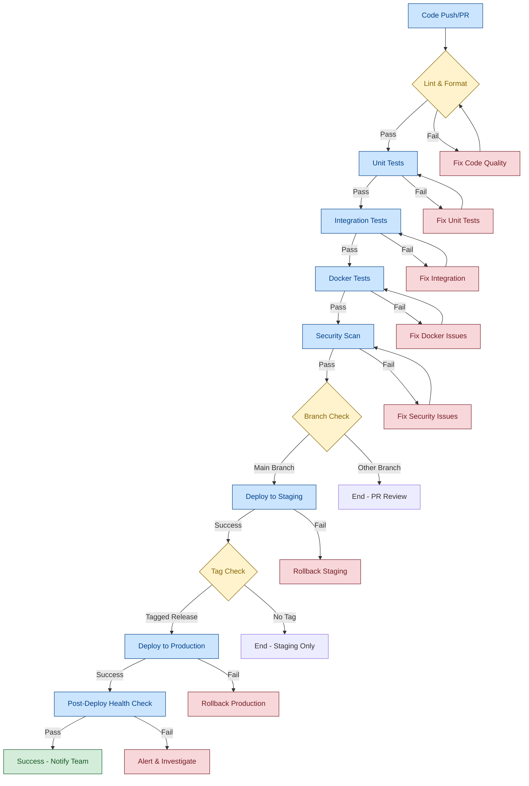
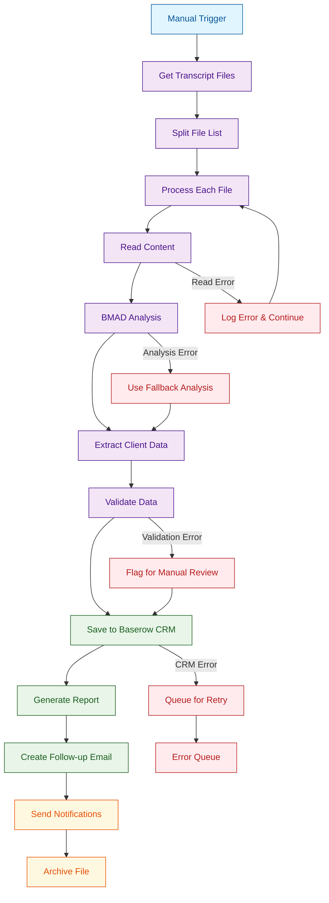
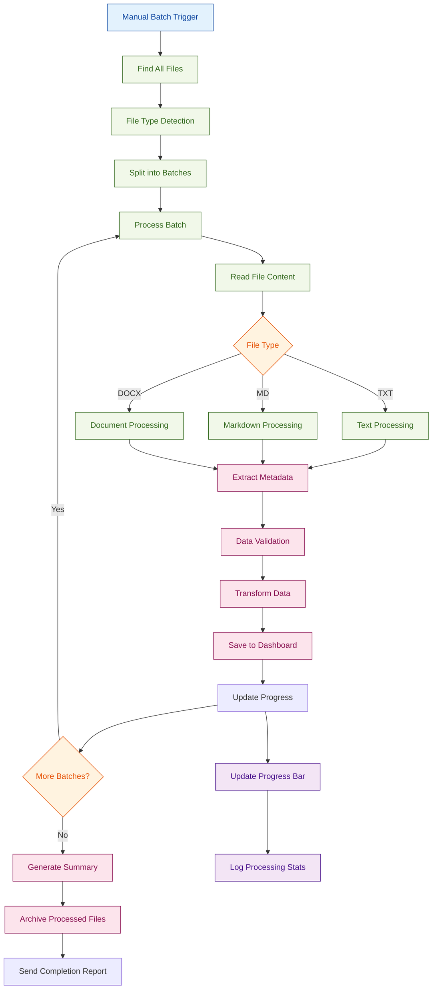
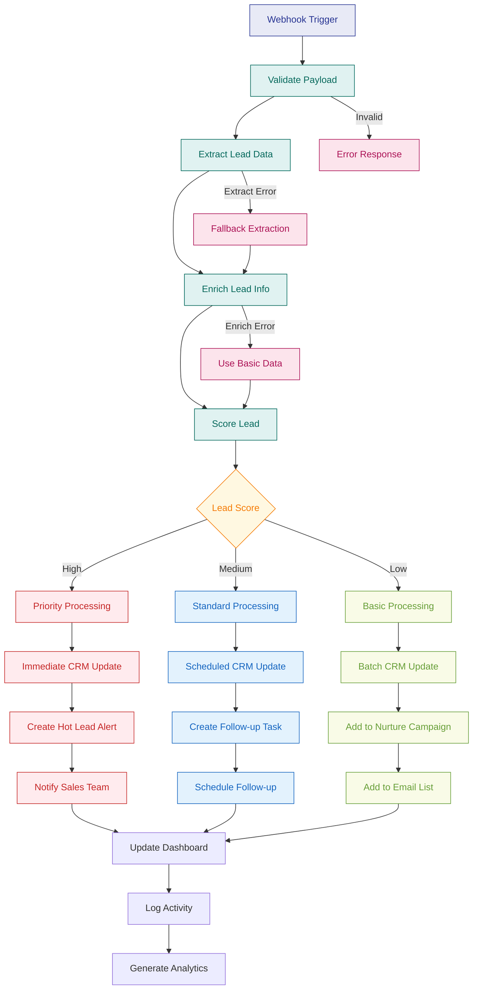
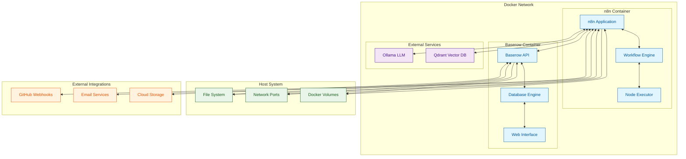
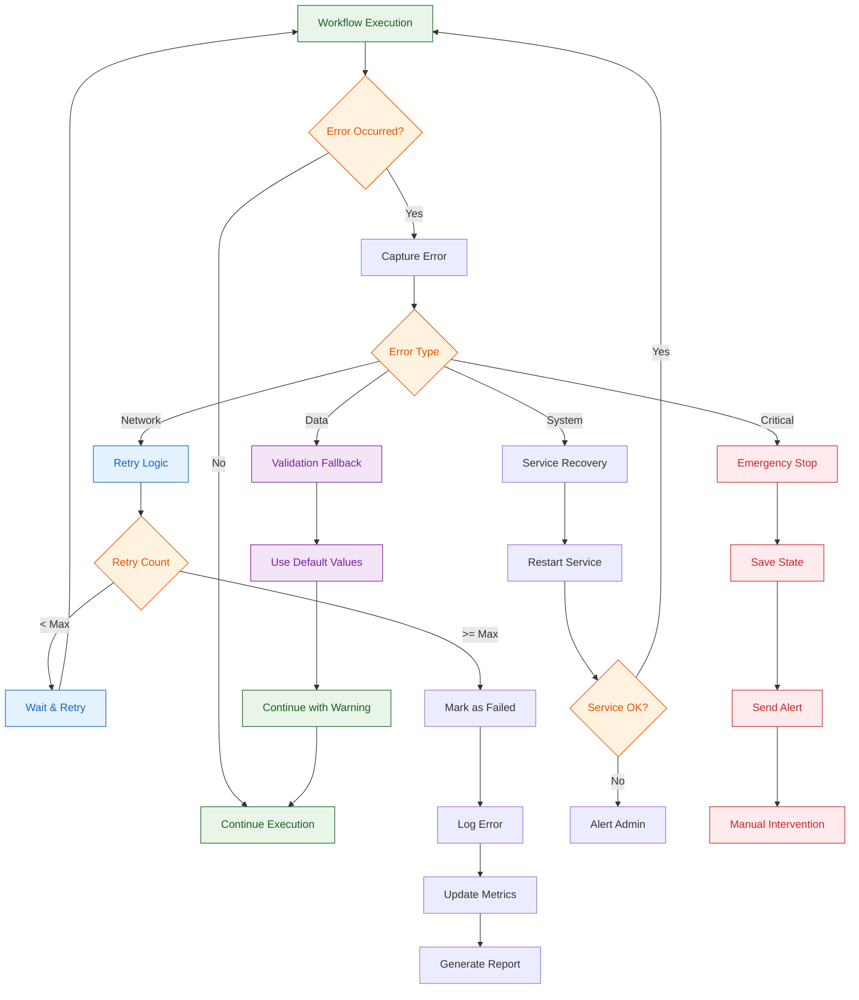
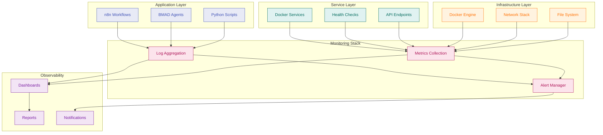
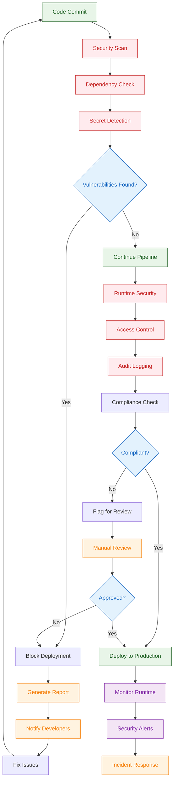
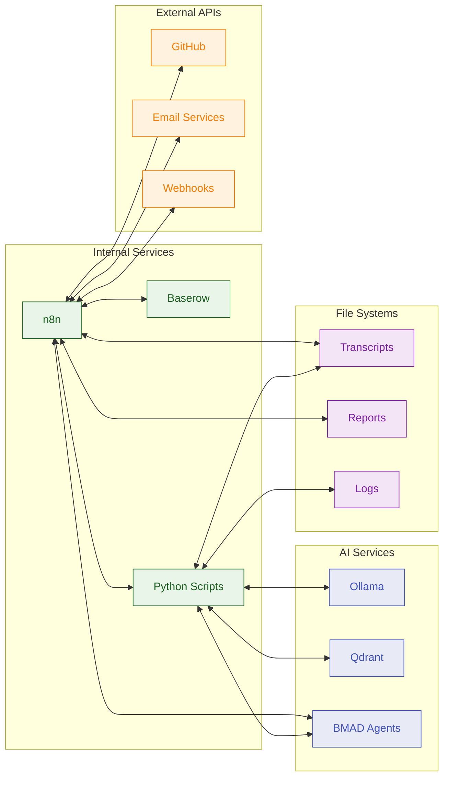

# 🎯 Workflow Diagrams

Visual representations of all workflows and CI/CD processes in the n8n-cursor-integration project.

## 🔄 CI/CD Pipeline Flow

## 🏠 Estate Planning Workflow

## 📦 Batch Processing Workflow

## 💼 Sales Processing Workflow

## 🐳 Docker Services Architecture

## 🔄 Error Handling Flow

## 📊 Monitoring & Observability

## 🔐 Security Flow

## 🔗 Integration Points

---

## 📝 Diagram Legend

- **🔄 Process Flow**: Sequential steps in a workflow
- **🔀 Decision Points**: Conditional branches based on criteria
- **⚠️ Error Handling**: Recovery and fallback mechanisms
- **📊 Data Flow**: Information movement between components
- **🔐 Security Gates**: Security checkpoints and validations
- **🔗 Integration**: Service connections and dependencies

## 🎯 Key Insights

1. **Resilience**: Multiple error handling paths ensure robustness
2. **Scalability**: Batch processing and service isolation support growth
3. **Security**: Multiple security gates protect against vulnerabilities
4. **Observability**: Comprehensive monitoring enables proactive management
5. **Integration**: Well-defined connection points enable extensibility

---

**Last Updated:** December 2024  
**Version:** 1.0  
**Maintainer:** Development Team