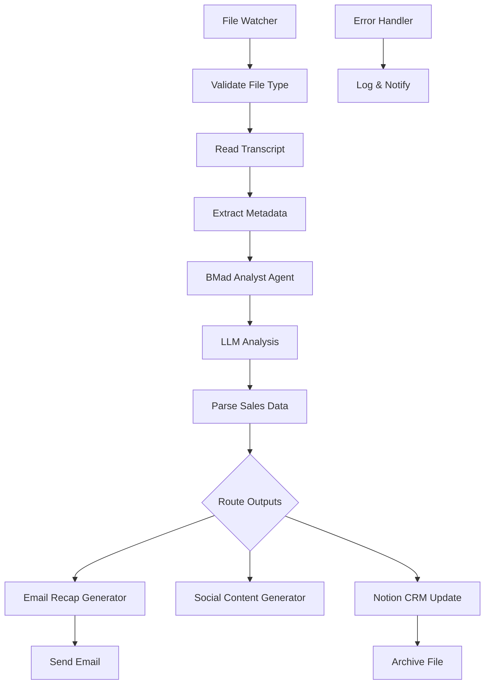

# Sales Transcript Processor Setup Guide

## Overview

This guide will help you set up the comprehensive sales transcript processing workflow that integrates BMad Method agents with n8n to automatically extract sales intelligence, generate follow-up emails, and create viral social media content from sales meeting transcripts.

## Architecture Overview



## Prerequisites

1. **n8n Setup**: Running n8n instance (see main README)
2. **OpenAI API**: Account with GPT-4 access
3. **Notion Integration**: API key and CRM database
4. **Email Service**: SMTP configuration
5. **File System Access**: Folder permissions for transcript monitoring

## Installation Steps

### 1. Environment Configuration

Copy the environment template:
```bash
cp .env.example .env
```

Edit `.env` with your configuration:
```bash
# File System Paths
TRANSCRIPT_FOLDER_PATH=/Users/yourname/sales-transcripts/incoming
PROCESSED_FOLDER_PATH=/Users/yourname/sales-transcripts/processed

# OpenAI Configuration
OPENAI_API_KEY=sk-your-key-here
OPENAI_MODEL=gpt-4
OPENAI_TEMPERATURE=0.3

# Notion Integration
NOTION_API_KEY=secret_your-notion-key
NOTION_CRM_DATABASE_ID=your-database-id

# Email Configuration
SENDER_EMAIL=sales@yourcompany.com
SALES_TEAM_EMAIL=team@yourcompany.com
SMTP_HOST=smtp.gmail.com
SMTP_PORT=587
SMTP_USER=your-email@gmail.com
SMTP_PASSWORD=your-app-password
```

### 2. Create Folder Structure

```bash
mkdir -p ~/sales-transcripts/{incoming,processed,archive}
chmod 755 ~/sales-transcripts/incoming
```

### 3. Set Up Notion CRM Database

Create a Notion database with these properties:

| Property Name | Type | Description |
|---------------|------|-------------|
| Company | Title | Company name |
| Meeting Date | Date | Date of meeting |
| Sales Stage | Select | lead_qualification, needs_assessment, etc. |
| Contact Name | Rich Text | Primary contact |
| Industry | Select | Company industry |
| Urgency | Select | high, medium, low |
| Budget Range | Rich Text | Budget information |
| Next Steps | Rich Text | Action items |
| Pain Points | Rich Text | Identified challenges |
| Transcript File | Files | Link to original transcript |

### 4. Import Workflow to n8n

1. Open n8n at `http://localhost:5679`
2. Click "Import from File"
3. Select `workflows/sales-transcript-processor.json`
4. Configure environment variables in n8n settings

### 5. Configure n8n Credentials

#### OpenAI Credential
- Type: OpenAI
- API Key: Your OpenAI API key
- Organization ID: (optional)

#### Notion Credential
- Type: Notion API
- API Key: Your Notion integration token
- Environment: Production

#### SMTP Credential
- Type: SMTP
- Host: Your SMTP host
- Port: SMTP port
- Username: Email username
- Password: Email password

## Workflow Components

### 1. File Watcher Trigger
- **Purpose**: Monitors transcript folder for new files
- **Supported Formats**: .txt, .md, .docx, .pdf
- **Trigger**: Automatic on file addition

### 2. BMad Method Integration
- **Agent**: Business Analyst (Mary)
- **Capabilities**: Strategic analysis, data extraction
- **Output**: Structured JSON with sales intelligence

### 3. Sales Data Extraction
Extracts comprehensive sales data:
- Contact information and roles
- Company details and industry
- Sales stage and metrics
- Pain points and urgency
- Budget indicators
- Decision criteria
- Next steps and timeline
- Competitive intelligence
- Key quotes for marketing

### 4. Email Recap Generation
Creates professional follow-up emails:
- **Follow-up**: Standard post-meeting recap
- **Proposal**: Proposal presentation follow-up
- **Demo**: Product demonstration recap
- **Closing**: Final negotiation follow-up

### 5. Social Media Content
Generates viral content for:
- **LinkedIn**: Professional insights and thought leadership
- **Twitter**: Quick takes and industry insights
- **Instagram**: Behind-the-scenes and inspirational
- **Facebook**: Community-focused storytelling
- **TikTok**: Trendy, short-form content

### 6. Notion CRM Integration
Automatically populates CRM with:
- Meeting metadata
- Extracted sales intelligence
- Contact information
- Next steps and timeline
- File attachments

## Usage Instructions

### 1. Transcript File Naming Convention

Use this naming format for optimal metadata extraction:
```
YYYY-MM-DD_CompanyName_MeetingType.txt
```

Examples:
- `2024-01-15_Acme Corp_Discovery.txt`
- `2024-01-16_TechStart_Demo.txt`
- `2024-01-17_BigEnterprise_Proposal.txt`

### 2. Transcript Content Structure

For best results, structure transcripts with:
```
Meeting: [Meeting Type] with [Company Name]
Date: [Date]
Attendees: [List of attendees with titles]
Duration: [Duration in minutes]

[Transcript content with speaker names]

Action Items:
- [Action item 1]
- [Action item 2]
```

### 3. Processing Workflow

1. **Drop transcript** in monitored folder
2. **Automatic processing** begins within seconds
3. **BMad Analyst** extracts sales intelligence
4. **Email recap** generated and sent
5. **Social content** created for all platforms
6. **CRM updated** with structured data
7. **File archived** to processed folder

## Monitoring and Troubleshooting

### View Workflow Executions
1. Go to n8n Executions tab
2. Monitor workflow runs in real-time
3. Check for errors or failures

### Common Issues

#### File Not Processing
- Check file format (.txt, .md, .docx, .pdf)
- Verify folder permissions
- Ensure file is completely written (not in use)

#### OpenAI API Errors
- Verify API key is correct
- Check account usage limits
- Ensure GPT-4 access is enabled

#### Notion Integration Issues
- Verify API key permissions
- Check database ID is correct
- Ensure all required properties exist

#### Email Not Sending
- Verify SMTP credentials
- Check email permissions
- Confirm recipient addresses

### Log Files

Monitor logs in n8n:
```bash
npm run logs
```

### Test Individual Components

Test scripts locally:
```bash
# Test sales data extractor
node scripts/test-runner.js sales-data-extractor.js

# Test email generator
node scripts/test-runner.js email-recap-generator.js

# Test social content generator
node scripts/test-runner.js social-content-generator.js
```

## Customization Options

### 1. Sales Data Fields
Edit `scripts/sales-data-extractor.js` to modify extracted fields

### 2. Email Templates
Customize templates in `scripts/email-recap-generator.js`

### 3. Social Content Strategy
Adjust content types in `scripts/social-content-generator.js`

### 4. BMad Agent Configuration
Modify analyst prompts for different analysis styles

### 5. Notion Database Schema
Add custom properties to match your CRM needs

## Performance Optimization

### 1. File Processing
- Use SSD storage for transcript folders
- Implement file size limits
- Consider batch processing for high volume

### 2. API Rate Limits
- Monitor OpenAI usage
- Implement retry logic
- Consider caching for repeated analysis

### 3. Storage Management
- Automatic archival of old transcripts
- Compress processed files
- Regular cleanup of temporary files

## Security Considerations

### 1. Data Protection
- Encrypt sensitive transcript data
- Secure API keys in environment variables
- Implement access controls on folders

### 2. PII Handling
- Review transcript content for PII
- Implement data retention policies
- Consider anonymization options

### 3. API Security
- Use HTTPS for all API calls
- Rotate API keys regularly
- Monitor for unusual usage patterns

## Integration Extensions

### 1. CRM Systems
- Salesforce integration
- HubSpot connectivity
- Custom CRM APIs

### 2. Communication Platforms
- Slack notifications
- Microsoft Teams integration
- Discord webhooks

### 3. Analytics Platforms
- Google Analytics events
- Mixpanel tracking
- Custom dashboards

## Support and Maintenance

### 1. Regular Updates
- Monitor n8n version updates
- Update OpenAI model versions
- Refresh BMad Method components

### 2. Backup Strategy
- Export workflow configurations
- Backup environment files
- Archive processed transcripts

### 3. Monitoring
- Set up health checks
- Monitor processing times
- Track success rates

## Advanced Features

### 1. Multi-Language Support
- Translate transcripts before processing
- Localize email templates
- Adapt social content for regions

### 2. AI Model Customization
- Fine-tune models for your industry
- Implement custom prompts
- Add domain-specific knowledge

### 3. Workflow Automation
- Schedule bulk processing
- Implement approval workflows
- Add quality control gates

## Success Metrics

Track these KPIs to measure success:

- **Processing Speed**: Time from file drop to completion
- **Extraction Accuracy**: Quality of extracted sales data
- **Email Engagement**: Open and response rates
- **Social Media Performance**: Engagement metrics
- **CRM Data Quality**: Completeness and accuracy
- **Sales Team Adoption**: Usage and feedback

## Getting Help

1. **Documentation**: Check the main README.md
2. **Issues**: Create GitHub issues for bugs
3. **Community**: Join the n8n community forums
4. **Support**: Contact your BMad Method provider

## Next Steps

After setup, consider:

1. **Training**: Train your sales team on the new workflow
2. **Optimization**: Fine-tune prompts and templates
3. **Expansion**: Add more integrations and automations
4. **Analytics**: Set up dashboards to track performance
5. **Scaling**: Consider cloud deployment for team use

Your sales transcript processing pipeline is now ready to transform your sales intelligence and follow-up processes!